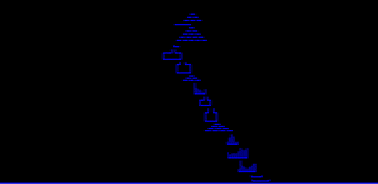

# Advent Of Code 2022 🎄


[Advent of Code](https://adventofcode.com) is an Advent calendar of small programming puzzles for a variety of skill sets and skill levels that can be solved in any programming language you like. People use them as interview prep, company training, university coursework, practice problems, a speed contest, or to challenge each other.

## Output
```
day  1 - step 1: 66487
day  1 - step 2: 197301

day  2 - step 1: 12855
day  2 - step 2: 13726

day  3 - step 1: 7716
day  3 - step 2: 2973

day  4 - step 1: 644
day  4 - step 2: 926

day  5 - step 1: FRDSQRRCD
day  5 - step 2: HRFTQVWNN

day  6 - step 1: 1876
day  6 - step 2: 2202

day  7 - step 1: 1581595
day  7 - step 2: 1544176

day  8 - step 1: 1736
day  8 - step 2: 268800

day  9 - step 1: 6339
day  9 - step 2: 2541

day 10 - step 1: 14820
day 10 - step 2:
###..####.####.#..#.####.####.#..#..##..
#..#....#.#....#.#..#....#....#..#.#..#.
#..#...#..###..##...###..###..####.#..#.
###...#...#....#.#..#....#....#..#.####.
#.#..#....#....#.#..#....#....#..#.#..#.
#..#.####.####.#..#.####.#....#..#.#..#.

day 11 - step 1: 72884
day 11 - step 1: 15310845153

day 12 - step 1: 520
day 12 - step 2: 508

day 13 - step 1: TODO!
day 13 - step 2: TODO!

day 14 - step 1: 885
day 14 - step 2: 28691
```

## Bonus
### Day 12


### Day 14

